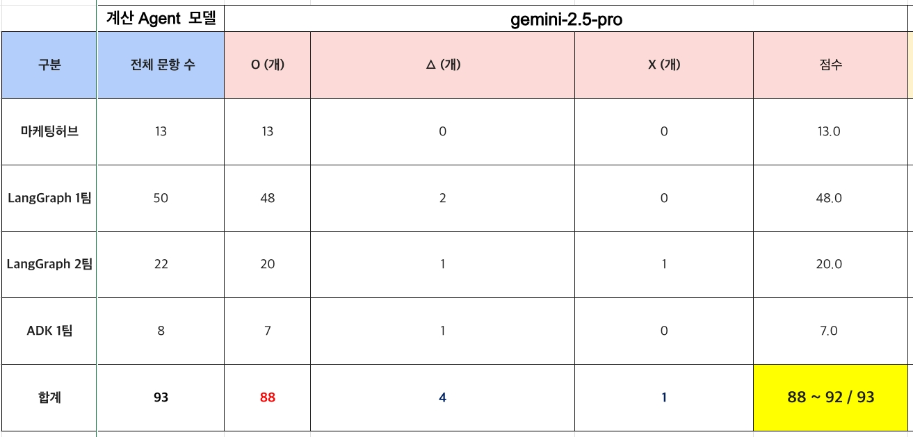
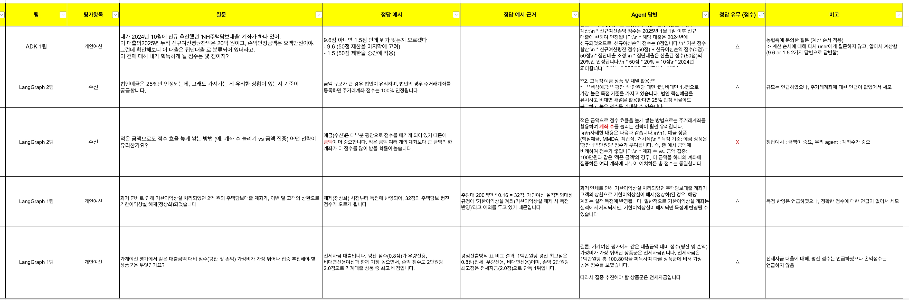
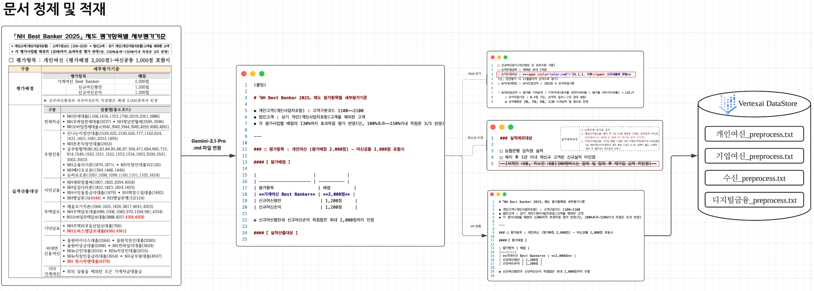
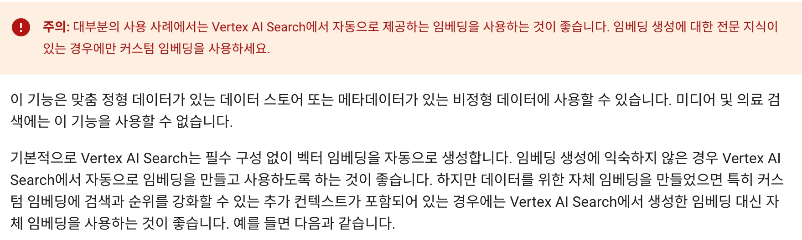
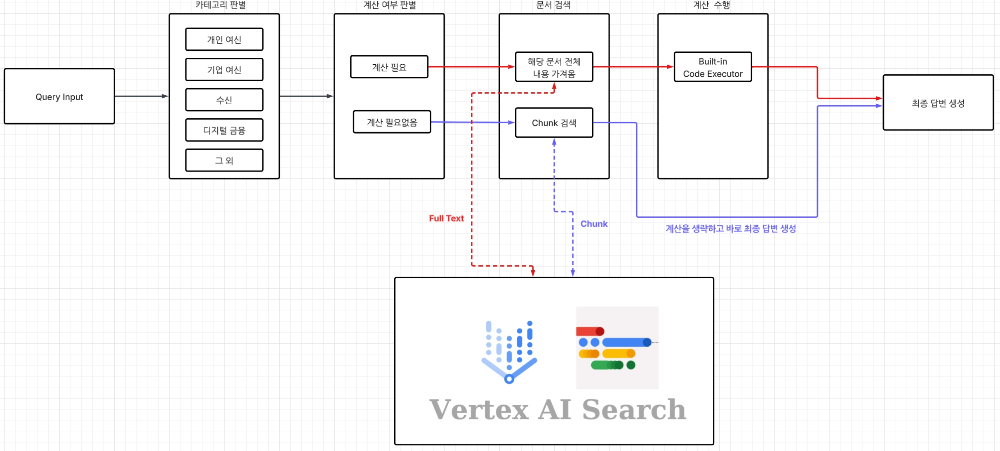

# NH 베스트뱅커 Agent PoC 진행 결과 (ADK 팀)

## ✅ 목차
- 질답 평가 점수
- 문서 전처리
- Google ADK(Agent Development Kit)
- VertexAI Search
- Agent 아키텍쳐
- 시연
---
## 1️⃣ 질답 평가 점수
https://tripodoffice-my.sharepoint.com/:x:/r/personal/whjeong_didim365_com/Documents/NH_POC_%E1%84%8C%E1%85%B5%E1%86%AF%E1%84%83%E1%85%A1%E1%86%B8_%E1%84%85%E1%85%B5%E1%84%89%E1%85%B3%E1%84%90%E1%85%B3_%E1%84%8E%E1%85%B1%E1%84%92%E1%85%A1%E1%86%B8_ADK.xlsx?d=w32dbde53889e47e89d0f159f034c1dd8&csf=1&web=1&e=S1pdIl



### 틀린 문항



---
## 2️⃣ 문서 전처리 

- **형식 변환 (PDF → MD)**: 상용 모델인 Gemini 3.1 Pro를 활용하여 원본 PDF 문서를 Markdown 형식으로 변환
- **태그 정제**: 변환된 MD 파일 내에 남아있는 HTML 잔재(색상 변환, `<br>` 태그 등)를 일괄 제거하여 텍스트 정제
- **취소선 처리**: 기존 문서 내 취소선으로 표시된 부분은 명시적으로 '취소됨'으로 텍스트화하여 의미 정보 유지
- **최종 포맷 변환 (MD → TXT)**: Vertex AI 지원 형식인 `.txt` 포맷으로 최종 전환 수행
- **분할 및 적재**: 정제된 전체 텍스트를 각 파트별로 잘라 4개의 파일로 분할한 뒤, Vertex AI Data Store에 적재
---
## 3️⃣ Google ADK(Agent Development Kit)
- LLM 에이전트를 빠르게 구축하기 위한 Google 의 공식 프레임워크
- 핵심 철학은 `선언적 에이전트 정의`로, Python 코드 몇 줄로 에이전트를 정의하고 즉시 실행할 수 있다.
- ADK의 `LlmAgent` 클래스는 **model(사용할 LLM)**, **instruction(에이전트 역할/행동 지침)**, **tools(사용 가능한 도구 목록)** 의 3가지 핵심 속성을 가지며, 이 선언만으로 완전한 에이전트가 생성됨 
- ADK는 LangGraph와 달리 그래프를 직접 구성하지 않고, 에이전트 간 관계/툴 사용 등을 선언적으로 정의
  - 이는 빠른 프로토타입에 유리하지만(장점), LangGraph처럼 세밀한 흐름 제어는 제한적(단점)

```python
from google_adk import agent

# tool 정의
def get_weather(location):
    """
    외부 api 호출해 날씨 정보를 가져옴
    """

    # 예시 : 외부 API 호출
    # endpoint = f"https://api.weather.com/v3/wx/conditions?q={location}"
    # response = requests.get(endpoint, params={"api_key": "YOUR_KEY"})
    
    return f"{location}의 현재 날씨는 '매우 맑음', 기온은 24도입니다."

# 에이전트 설정: 똑똑한 비서 고용
weather_bot = agent.LlmAgent(
    model="gemini-2.5-flash",
    instruction="""
    당신은 '스마트 날씨 비서'입니다.
    [규칙]
    - 사용자가 특정 지역의 날씨를 물어보면 'get_weather' 도구를 실행하세요.
    """,
    tools=[get_weather]
)
```
---
## 4️⃣ VertexAI Search
### google 클라우드의 VertexAI 환경에서 지원하는 강력한 `검색 엔진`
- Vertex AI : AI 통합 관리 플랫폼으로 모델 학습, 배포, trace, 로깅, 관리, 테스트, 평가 등등을 할 수 있음
<!--  -->
<!--  -->

### 데이터 스토어 (Data Store)

- 검색의 대상이 되는 `원천 데이터의 저장소`
  - 데이터 소스 연결: Google Cloud Storage(GCS), BigQuery, 또는 API를 통한 직접 업로드를 지원
  - 문서 처리: 비정형 데이터(PDF, HTML, TXT)나 정형 데이터(JSON, CSV)를 수집하여 텍스트를 추출하고 분할(Chunking)함
  - 임베딩(Embedding): 텍스트 데이터를 고차원 벡터로 변환하여 벡터 데이터베이스 형태로 인덱싱

### 파서 (Parsing)
- `Digital Parser`(기본/무료) : 일반 텍스트 추출 중심
- `Layout Parser`(유료) : 문서 구조/계층(제목, 목록, 표, 머리글/각주 등) 인식 (txt파일 지원하지 않음)
- `OCR Parser for PDF`(유료) : 스캔 PDF/이미지 포함 PDF에 최적화. **PDF 전용**, **최대 500페이지**

### 청킹 (Chunking)
- `LayoutBasedChunking` : 문서 레이아웃(제목, 부제목, 단락, 표 등) 을 인식하고 청킹에서 이를 고려함. 

### 임베딩
- 기본적으로 Vertex AI Search가 임베딩을 **자동 생성**(대부분은 기본값 권장)
- 이미 자체 임베딩이 있다면 업로드/지정해서 검색에 활용 가능(내부 용어 반영, 사용자 프로필 기반 개인화 등)
- 제약(요약)
  - 대상: **정형 데이터** 또는 **메타데이터가 있는 비정형 데이터**
  - 미지원: **미디어/의료 검색**
  - 형식: 1차원 배열, 차원수 `1~768`
  - 임베딩 키 속성(필드) 최대 2개 태그 가능, **설정 후 삭제 불가**



### 앱 / 엔진 (App / Engine)
- 데이터 스토어에 씌워지는 검색 엔진
- 하나의 앱(엔진) 에 여러 개의 데이터 스토어를 연결할 수 있음
- App 의 종류
  - Search (검색): 가장 일반적인 형태. 문서나 사이트에서 정보를 찾는데 사용
  - Recommendation (추천): 사용자의 패턴을 학습해 콘텐츠나 상품을 추천
  - Healthcare Search: 의료 데이터(FHIR 등)에 특화된 검색 엔진

### 하이브리드 검색
- **키워드 검색(정확 일치)** 과 **시맨틱 검색(의미/문맥 유사)** 을 함께 수행하고,
- 각 결과를 결합해 최종 랭킹을 결정
---
## 5️⃣ Agent 아키텍쳐

---
## 시연
### 질문 1
```
내가 2025년 2월에 신규로 추진한 'NH전세대출' 계좌가 하나 있어. 
이 계좌의 신규여신평균잔액은 1억 5천만 원이고, 
손익인정금액은 120만 원이야. 이 건으로 내가 받을 수 있는 점수는 몇 점이지?
```

### 질문 2
```
NICS 4A등급 신용대출 평잔이 472356729원인데 인정금액이 얼마야?
```

### 질문 3
```
집단대출이나 작년 신규분 이월실적은 점수 반영이 어떻게 되나요?
```
---